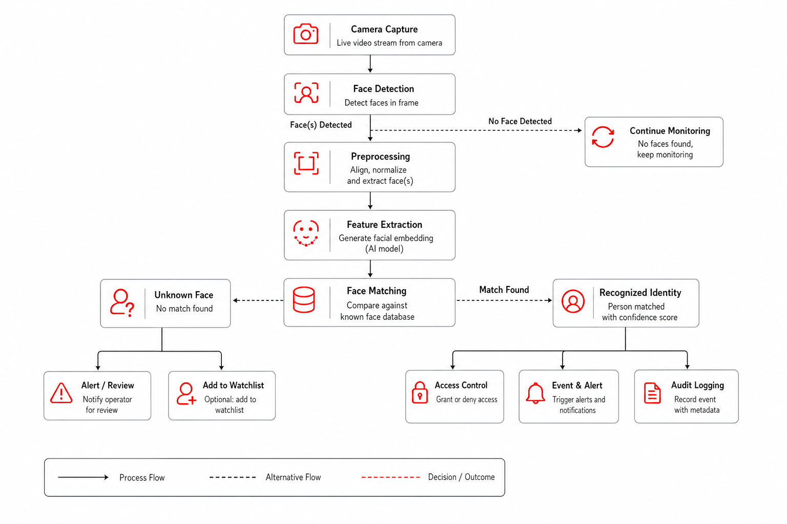
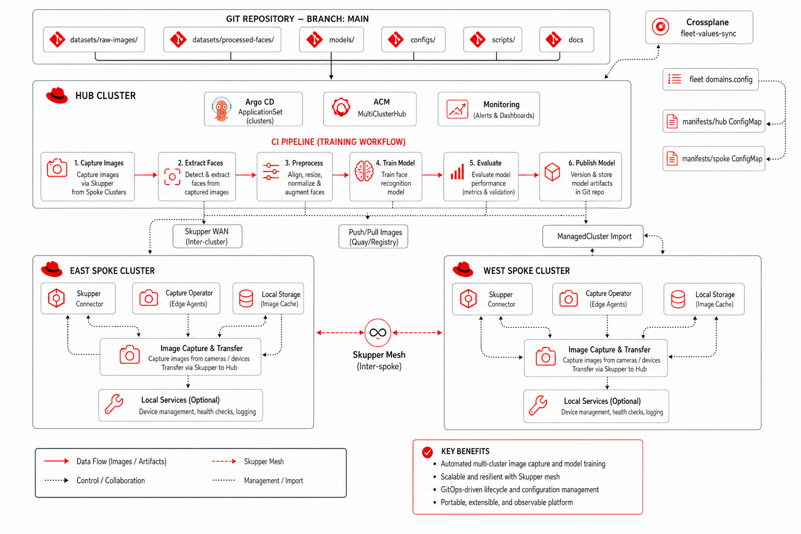
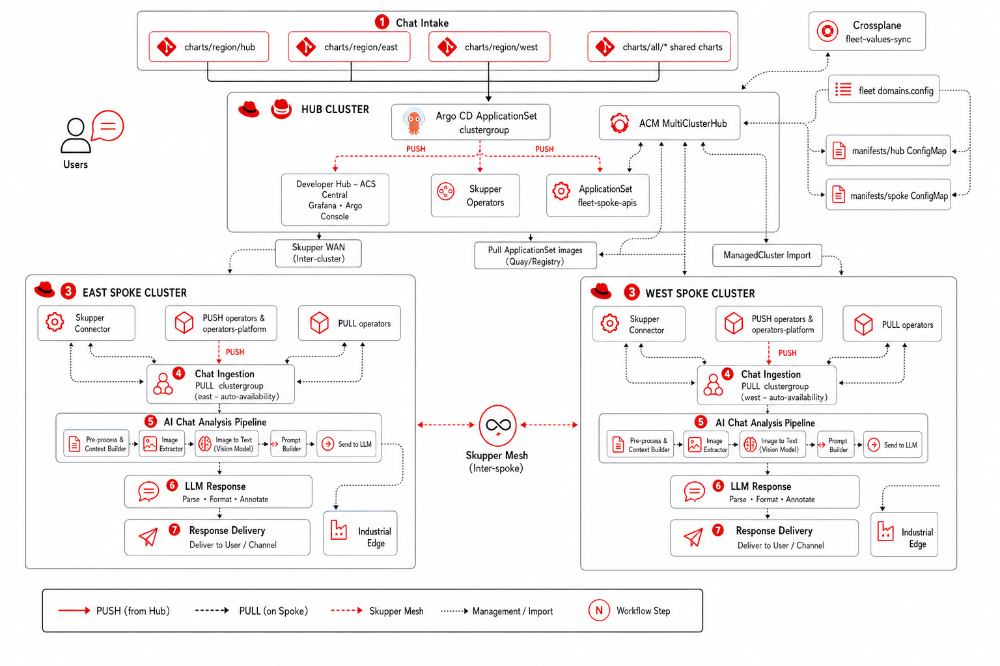

<p align="center">
  
</p>

<h1 align="center">NeuroFace - Facial Recognition & Object Detection</h1>

<p align="center">
  <a href="https://artifacthub.io/packages/helm/neuroface/neuroface"></a>
  <a href="https://github.com/maximilianoPizarro/neuroface/releases/tag/v1.4.1"></a>
  <a href="https://quay.io/repository/maximilianopizarro/neuroface-backend"></a>
  <a href="https://quay.io/repository/maximilianopizarro/neuroface-frontend"></a>
  <a href="https://developers.redhat.com/developer-sandbox"></a>
  <a href="https://maximilianopizarro.github.io/neuroface/"></a>
</p>

Facial recognition and object detection web application based on the [reconocimiento-facial](https://github.com/maximilianoPizarro/reconocimiento-facial) archetype. Built with **FastAPI** (Python) and **Angular 17**, containerized with Red Hat UBI9 certified images for **Podman Desktop** and **OpenShift**.

**v1.4.1** — Red Hat ecosystem documentation, PPE serving (KServe v2), Kafka events, and S3 data persistence.

### Video Demo

<p align="center">
  <a href="https://youtu.be/lvFu5u7slXg"></a>
</p>

---

## Architecture Overview

| Layer | Technology | Description |
|-------|-----------|-------------|
| **Frontend** | Angular 17, Material | SPA served by Nginx (UBI9); webcam capture via WebRTC, canvas overlay. |
| **Backend** | FastAPI, OpenCV, Python 3.11 | REST API for face detection, recognition, object detection, training. |
| **Face Detection** | OpenCV Haar Cascades / OpenVINO | Switchable at runtime. OpenVINO uses `face-detection-retail-0005` via ModelMesh. |
| **Object Detection** | YOLOv4-tiny (OpenCV DNN) | 80 COCO classes pre-trained. Bundled in the backend image. |
| **Recognition** | OpenCV LBPH (default) | Configurable via `AI_MODEL` env. Optional: dlib/face_recognition. |
| **Data** | Filesystem | Training images, Haar cascades, YOLO weights, serialized models under `/data`. |

**Containers (Podman/OpenShift):** Backend uses `registry.access.redhat.com/ubi9/python-311`. Frontend uses `registry.access.redhat.com/ubi9/nginx-122`.

---

## Architecture Diagram

<p align="center">
  
</p>

## PPE Detection & Sequence Flow

<p align="center">
  
</p>

## Face Recognition Flow

<p align="center">
  
</p>

## Object Detection Flow

<p align="center">
  
</p>

## Training Flow

<p align="center">
  
</p>

## AI Chat Analysis Flow

<p align="center">
  
</p>

---

## Prerequisites

- **Python 3.11** — backend development
- **Node.js 20** — Angular frontend (`npm install` and `npm run build`)
- **Podman** (and optionally **podman-compose**) — containerized run
- **Helm 3** — Kubernetes/OpenShift deployment
- **Red Hat OpenShift Dev Spaces** — optional, devfile-based workspace

---

## Running the Solution

### Local Development

**Backend:**

```bash
cd backend
python -m venv venv
source venv/bin/activate  # or venv\Scripts\activate on Windows
pip install -r requirements.txt
uvicorn app.main:app --reload --port 8080
```

**Frontend:**

```bash
cd frontend
npm install
npm start
```

Open **http://localhost:4200**. The Angular dev server proxies `/api` to `http://localhost:8080`.

### Containers (Podman Compose)

```bash
podman-compose up -d --build
```

- **Frontend:** http://localhost:4200
- **Backend API:** http://localhost:8080/api
- **Swagger docs:** http://localhost:8080/docs

### Build and Push to Quay.io

```bash
./build-push-quay.sh [quay-namespace] [--tag v1.4.1]
```

Default namespace: `maximilianopizarro`. Requires `podman login quay.io`.

### Helm Chart (Kubernetes / OpenShift)

```bash
helm repo add neuroface https://maximilianopizarro.github.io/neuroface/
helm install neuroface neuroface/neuroface
```

#### With OpenVINO (using external ModelMesh)

```bash
helm install neuroface neuroface/neuroface \
  --set ovms.externalUrl=http://modelmesh-serving:8008 \
  --set ovms.modelName=face-detection-retail-0005
```

When `ovms.externalUrl` is set, no standalone OVMS is deployed — the backend connects to the existing ModelMesh service.

### Red Hat OpenShift Dev Spaces

The `devfile.yaml` defines components for Python backend and Node.js frontend development with predefined build/run commands.

---

## OpenVINO on Developer Sandbox

To use the OpenVINO face detection from **any** Red Hat Developer Sandbox account, deploy the `face-detection-retail-0005` model on OpenShift AI. Full step-by-step guide is available on the [GitHub Pages documentation](https://maximilianopizarro.github.io/neuroface/).

---

## API Endpoints

| Endpoint | Method | Description |
|----------|--------|-------------|
| `/api/health` | GET | Liveness probe |
| `/api/ready` | GET | Readiness probe (includes `ovms_status`, `object_detection`) |
| `/api/recognize` | POST | Detect + recognize faces |
| `/api/train` | POST | Train model using active detection method |
| `/api/images` | POST | Upload training image for a label |
| `/api/images/{label}` | GET/DELETE | List or delete images for a label |
| `/api/labels` | GET | List known persons/labels |
| `/api/models/config` | GET/PUT | View or change AI recognition model |
| `/api/models/detection` | PUT | Switch detection method: `opencv` or `openvino` |
| `/api/models/available` | GET | List available models and detection methods |
| `/api/objects/detect` | POST | Detect objects in image (YOLOv4-tiny, 80 COCO classes) |
| `/api/objects/classes` | GET | List all 80 detectable COCO object classes |
| `/api/objects/status` | GET | Object detector status and info |
| `/api/chat` | POST | AI chat with face + object analysis context |
| `/api/chat/status` | GET | Chat feature status |

---

## AI Model Configuration

### Detection Methods

| Method | Engine | Description |
|--------|--------|-------------|
| `opencv` | OpenCV Haar Cascades | Local CPU detection. Default, no external dependencies. |
| `openvino` | OpenVINO Model Server | Remote detection via `face-detection-retail-0005` on ModelMesh. |

### Object Detection

| Model | Engine | Classes | Description |
|-------|--------|---------|-------------|
| YOLOv4-tiny | OpenCV DNN | 80 COCO | Pre-trained, bundled in backend image (~24MB weights). |

COCO classes: person, bicycle, car, motorbike, aeroplane, bus, train, truck, boat, traffic light, fire hydrant, stop sign, parking meter, bench, bird, cat, dog, horse, sheep, cow, elephant, bear, zebra, giraffe, backpack, umbrella, handbag, tie, suitcase, frisbee, skis, snowboard, sports ball, kite, baseball bat, baseball glove, skateboard, surfboard, tennis racket, bottle, wine glass, cup, fork, knife, spoon, bowl, banana, apple, sandwich, orange, broccoli, carrot, hot dog, pizza, donut, cake, chair, sofa, pottedplant, bed, diningtable, toilet, tvmonitor, laptop, mouse, remote, keyboard, cell phone, microwave, oven, toaster, sink, refrigerator, book, clock, vase, scissors, teddy bear, hair drier, toothbrush.

### Recognition Models

| Value | Model | Required Package |
|-------|-------|-----------------|
| `lbph` | OpenCV LBPH (default) | `opencv-contrib-python-headless` |
| `dlib` | face_recognition (dlib) | `face_recognition` (optional) |

---

## Helm Chart Values

| Value | Default | Description |
|-------|---------|-------------|
| `backend.aiModel` | `lbph` | Recognition model |
| `backend.image.tag` | `v1.4.1` | Backend image tag |
| `frontend.image.tag` | `v1.4.1` | Frontend image tag |
| `ovms.enabled` | `true` | Enable OpenVINO detection |
| `ovms.externalUrl` | `""` | External OVMS/ModelMesh REST URL |
| `ovms.modelName` | `face-detection-retail-0005` | Model name on OVMS |
| `ovms.confidenceThreshold` | `0.5` | Detection confidence threshold |
| `ovms.defaultDetectionMethod` | `opencv` | Initial detection method |
| `chat.enabled` | `true` | Enable AI chat feature |
| `persistence.enabled` | `true` | Use PVC for training data |

---

## Project Structure

```
neuroface/
├── backend/                    # FastAPI backend
│   ├── app/
│   │   ├── main.py             # FastAPI entry point
│   │   ├── api/                # Route handlers
│   │   │   ├── objects.py      # Object detection endpoints
│   │   │   └── chat.py         # AI chat with face + object context
│   │   ├── core/               # Config + face engine
│   │   ├── models/             # Pluggable AI models
│   │   │   ├── base.py         # Abstract model interface
│   │   │   ├── lbph_model.py   # OpenCV LBPH recognizer
│   │   │   ├── dlib_model.py   # Optional dlib recognizer
│   │   │   ├── openvino_detector.py  # OpenVINO OVMS client
│   │   │   └── object_detector.py    # YOLOv4-tiny (80 COCO classes)
│   │   └── resources/          # Haar cascades
│   ├── requirements.txt
│   └── Dockerfile
├── frontend/                   # Angular 17 SPA
│   ├── src/app/
│   │   ├── components/
│   │   │   ├── objects/        # Object detection UI
│   │   │   ├── recognition/    # Multi-person face grid
│   │   │   └── chat/           # Enhanced AI chat
│   │   └── services/           # API + Camera services
│   ├── nginx.conf
│   └── Dockerfile
├── helm/neuroface/             # Helm chart (v1.4.1)
├── docs/                       # GitHub Pages + screenshots
├── .github/workflows/          # CI/CD
├── devfile.yaml                # Red Hat Dev Spaces
├── docker-compose.yml          # Podman Desktop
├── build-push-quay.sh          # Build + push script
└── README.md
```

---

## Container Images

| Image | Tag | Description |
|-------|-----|-------------|
| `quay.io/maximilianopizarro/neuroface-backend` | `latest` / `v1.0.1` | Without OpenVINO |
| `quay.io/maximilianopizarro/neuroface-backend` | `v1.1.0` | With OpenVINO integration |
| `quay.io/maximilianopizarro/neuroface-backend` | `v1.1.1` | Red Hat UI + mobile flash |
| `quay.io/maximilianopizarro/neuroface-backend` | `v1.4.1` | PPE persistence, Kafka, object detection |
| `quay.io/maximilianopizarro/neuroface-frontend` | `v1.4.1` | PPE UI, object detection, enhanced chat |
| `quay.io/maximilianopizarro/neuroface-ppe-serving` | `v1.4.1` | YOLOv8 PPE KServe v1+v2 |

---

## License

See repository license file if present.
