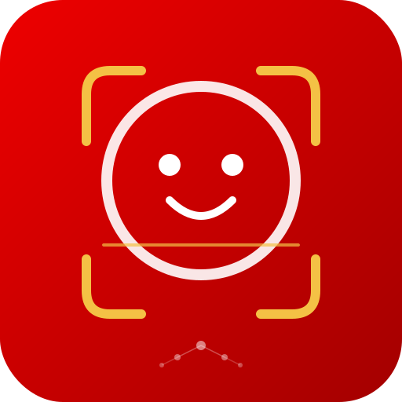

<p align="center">
  
</p>

<h1 align="center">NeuroFace - Facial Recognition Webapp with ML</h1>

<p align="center">
  <a href="https://artifacthub.io/packages/helm/neuroface/neuroface"></a>
  <a href="https://github.com/maximilianoPizarro/neuroface/releases/tag/v1.1.0"></a>
  <a href="https://quay.io/repository/maximilianopizarro/neuroface-backend"></a>
  <a href="https://quay.io/repository/maximilianopizarro/neuroface-frontend"></a>
</p>

Facial recognition web application based on the [reconocimiento-facial](https://github.com/maximilianoPizarro/reconocimiento-facial) archetype. Built with **FastAPI** (Python) and **Angular 17**, containerized with Red Hat UBI9 certified images for **Podman Desktop** and **OpenShift**.

**v1.1.0** adds **OpenVINO Model Server** integration for remote AI-powered face detection via OpenShift AI / ModelMesh.

---

## Architecture Overview

| Layer | Technology | Description |
|-------|-----------|-------------|
| **Frontend** | Angular 17, Material | SPA served by Nginx (UBI9); webcam capture via WebRTC, canvas overlay. |
| **Backend** | FastAPI, OpenCV, Python 3.11 | REST API for face detection, recognition, training. Pluggable AI models. |
| **Detection** | OpenCV Haar Cascades / OpenVINO | Switchable at runtime. OpenVINO uses `face-detection-retail-0005` via ModelMesh. |
| **Recognition** | OpenCV LBPH (default) | Configurable via `AI_MODEL` env. Optional: dlib/face_recognition. |
| **Data** | Filesystem | Training images, Haar cascades, serialized models under `/data`. |

**Containers (Podman/OpenShift):** Backend uses `registry.access.redhat.com/ubi9/python-311`. Frontend uses `registry.access.redhat.com/ubi9/nginx-122`.

---

## Architecture Diagram

```
┌──────────────────────────┐       ┌──────────────────────────────────┐
│  Frontend (Angular 17)   │       │  Backend (FastAPI on UBI9)       │
│                          │       │                                  │
│  WebRTC Camera ──────────┼─POST──┼─▶ /api/recognize                │
│  Training Upload ────────┼─POST──┼─▶ /api/images, /api/train       │
│  Model Config ───────────┼─PUT───┼─▶ /api/models/config            │
│  Detection Switch ───────┼─PUT───┼─▶ /api/models/detection         │
│                          │       │                                  │
│  Nginx (:8080)           │       │  Uvicorn (:8080)                │
└──────────────────────────┘       │  ┌────────────────────────────┐  │
                                   │  │ Detection (switchable)     │  │
                                   │  │  ├─ OpenCV Haar Cascades   │  │
                                   │  │  └─ OpenVINO OVMS ─────────┼──┼──▶ ModelMesh
                                   │  ├────────────────────────────┤  │    :8008
                                   │  │ Recognition (pluggable)    │  │
                                   │  │  ├─ LBPH (default)         │  │
                                   │  │  └─ dlib (optional)        │  │
                                   │  └────────────────────────────┘  │
                                   └──────────────────────────────────┘
```

---

## Prerequisites

- **Python 3.11** — backend development
- **Node.js 20** — Angular frontend (`npm install` and `npm run build`)
- **Podman** (and optionally **podman-compose**) — containerized run
- **Helm 3** — Kubernetes/OpenShift deployment
- **Red Hat OpenShift Dev Spaces** — optional, devfile-based workspace

---

## Running the Solution

### Local Development

**Backend:**

```bash
cd backend
python -m venv venv
source venv/bin/activate  # or venv\Scripts\activate on Windows
pip install -r requirements.txt
uvicorn app.main:app --reload --port 8080
```

**Frontend:**

```bash
cd frontend
npm install
npm start
```

Open **http://localhost:4200**. The Angular dev server proxies `/api` to `http://localhost:8080`.

### Containers (Podman Compose)

```bash
podman-compose up -d --build
```

- **Frontend:** http://localhost:4200
- **Backend API:** http://localhost:8080/api
- **Swagger docs:** http://localhost:8080/docs

### Build and Push to Quay.io

```bash
./build-push-quay.sh [quay-namespace] [--tag v1.1.0]
```

Default namespace: `maximilianopizarro`. Requires `podman login quay.io`.

### Helm Chart (Kubernetes / OpenShift)

```bash
helm repo add neuroface https://maximilianopizarro.github.io/neuroface/
helm install neuroface neuroface/neuroface
```

#### With OpenVINO (using external ModelMesh)

```bash
helm install neuroface neuroface/neuroface \
  --set ovms.externalUrl=http://modelmesh-serving:8008 \
  --set ovms.modelName=face-detection-retail-0005
```

When `ovms.externalUrl` is set, no standalone OVMS is deployed — the backend connects to the existing ModelMesh service.

### Red Hat OpenShift Dev Spaces

The `devfile.yaml` defines components for Python backend and Node.js frontend development with predefined build/run commands.

---

## OpenVINO on Developer Sandbox

To use the OpenVINO face detection from **any** Red Hat Developer Sandbox account, deploy the `face-detection-retail-0005` model on OpenShift AI. Full step-by-step guide is available on the [GitHub Pages documentation](https://maximilianopizarro.github.io/neuroface/).

### Quick Deploy (all steps)

```bash
# 1. Create ServingRuntime
oc apply -f - <<'EOF'
apiVersion: serving.kserve.io/v1alpha1
kind: ServingRuntime
metadata:
  name: neuroface
  annotations:
    openshift.io/display-name: "NeuroFace OpenVINO Runtime"
  labels:
    opendatahub.io/dashboard: "true"
spec:
  supportedModelFormats:
    - name: openvino_ir
      version: opset1
      autoSelect: true
    - name: onnx
      version: "1"
    - name: tensorflow
      version: "2"
  multiModel: true
  grpcDataEndpoint: port:8001
  grpcEndpoint: port:8085
  containers:
    - name: ovms
      image: quay.io/modelmesh-serving/ovms-adapter:latest
      args:
        - --port=8001
        - --rest_port=8888
        - --model_store=/models
        - --grpc_bind_address=127.0.0.1
        - --rest_bind_address=127.0.0.1
      resources:
        requests:
          cpu: 500m
          memory: 3Gi
        limits:
          cpu: "2"
          memory: 3Gi
  builtInAdapter:
    serverType: ovms
    runtimeManagementPort: 8888
    memBufferBytes: 134217728
    modelLoadingTimeoutMillis: 90000
EOF

# 2. Create PVC for model files
oc apply -f - <<'EOF'
apiVersion: v1
kind: PersistentVolumeClaim
metadata:
  name: neuroface-models
spec:
  accessModes: [ReadWriteOnce]
  resources:
    requests:
      storage: 2Gi
  storageClassName: gp3
EOF

# 3. Configure ModelMesh storage
oc apply -f - <<'EOF'
apiVersion: v1
kind: Secret
metadata:
  name: storage-config
stringData:
  neuroface-models: |
    {"type": "pvc", "name": "neuroface-models"}
EOF

# 4. Download model from Open Model Zoo
oc apply -f - <<'EOF'
apiVersion: batch/v1
kind: Job
metadata:
  name: download-face-model
spec:
  template:
    spec:
      containers:
        - name: downloader
          image: registry.access.redhat.com/ubi9/python-311:latest
          command:
            - bash
            - -c
            - |
              pip install openvino-dev[onnx,tensorflow] > /dev/null 2>&1
              omz_downloader --name face-detection-retail-0005 --precision FP16 -o /tmp/models
              mkdir -p /models/face-detection-retail-0005/1
              cp /tmp/models/intel/face-detection-retail-0005/FP16/* /models/face-detection-retail-0005/1/
              ls -la /models/face-detection-retail-0005/1/
          volumeMounts:
            - name: model-storage
              mountPath: /models
      volumes:
        - name: model-storage
          persistentVolumeClaim:
            claimName: neuroface-models
      restartPolicy: Never
  backoffLimit: 2
EOF

oc wait --for=condition=complete job/download-face-model --timeout=300s

# 5. Deploy InferenceService
oc apply -f - <<'EOF'
apiVersion: serving.kserve.io/v1beta1
kind: InferenceService
metadata:
  name: face-detection-retail-0005
  annotations:
    serving.kserve.io/deploymentMode: ModelMesh
spec:
  predictor:
    model:
      modelFormat:
        name: openvino_ir
      runtime: neuroface
      storage:
        key: neuroface-models
        path: face-detection-retail-0005
EOF

oc wait --for=condition=Ready inferenceservice/face-detection-retail-0005 --timeout=300s

# 6. Deploy NeuroFace
helm repo add neuroface https://maximilianopizarro.github.io/neuroface/
helm install neuroface neuroface/neuroface \
  --set ovms.externalUrl=http://modelmesh-serving:8008 \
  --set ovms.modelName=face-detection-retail-0005
```

---

## API Endpoints

| Endpoint | Method | Description |
|----------|--------|-------------|
| `/api/health` | GET | Liveness probe |
| `/api/ready` | GET | Readiness probe (includes `ovms_status`, `detection_method`) |
| `/api/recognize` | POST | Send base64 frame, returns detected faces with `detection_method` |
| `/api/train` | POST | Train model using active detection method |
| `/api/images` | POST | Upload training image for a label |
| `/api/images/{label}` | GET/DELETE | List or delete images for a label |
| `/api/labels` | GET | List known persons/labels |
| `/api/models/config` | GET/PUT | View or change AI recognition model |
| `/api/models/detection` | PUT | Switch detection method: `opencv` or `openvino` |
| `/api/models/available` | GET | List available models and detection methods |

---

## AI Model Configuration

### Detection Methods (v1.1.0)

| Method | Engine | Description |
|--------|--------|-------------|
| `opencv` | OpenCV Haar Cascades | Local CPU detection. Default, no external dependencies. |
| `openvino` | OpenVINO Model Server | Remote detection via `face-detection-retail-0005` on ModelMesh. |

Switch at runtime via UI or API:

```bash
curl -X PUT /api/models/detection -d '{"detection_method": "openvino"}'
```

### Recognition Models

| Value | Model | Required Package |
|-------|-------|-----------------|
| `lbph` | OpenCV LBPH (default) | `opencv-contrib-python-headless` |
| `dlib` | face_recognition (dlib) | `face_recognition` (optional) |

---

## Helm Chart Values

| Value | Default | Description |
|-------|---------|-------------|
| `backend.aiModel` | `lbph` | Recognition model |
| `backend.image.tag` | `v1.1.0` | Backend image tag |
| `frontend.image.tag` | `v1.1.0` | Frontend image tag |
| `ovms.enabled` | `true` | Enable OpenVINO detection |
| `ovms.externalUrl` | `""` | External OVMS/ModelMesh REST URL |
| `ovms.modelName` | `face-detection-retail-0005` | Model name on OVMS |
| `ovms.confidenceThreshold` | `0.5` | Detection confidence threshold |
| `ovms.defaultDetectionMethod` | `opencv` | Initial detection method |
| `chat.enabled` | `true` | Enable AI chat feature |
| `persistence.enabled` | `true` | Use PVC for training data |

---

## Project Structure

```
neuroface/
├── backend/                    # FastAPI backend
│   ├── app/
│   │   ├── main.py             # FastAPI entry point
│   │   ├── api/                # Route handlers
│   │   ├── core/               # Config + face engine
│   │   ├── models/             # Pluggable AI models
│   │   │   ├── base.py         # Abstract model interface
│   │   │   ├── lbph_model.py   # OpenCV LBPH recognizer
│   │   │   ├── dlib_model.py   # Optional dlib recognizer
│   │   │   └── openvino_detector.py  # OpenVINO OVMS client
│   │   └── resources/          # Haar cascades
│   ├── requirements.txt
│   └── Dockerfile
├── frontend/                   # Angular 17 SPA
│   ├── src/app/
│   │   ├── components/         # UI components
│   │   └── services/           # API + Camera services
│   ├── nginx.conf
│   └── Dockerfile
├── helm/neuroface/             # Helm chart (v1.1.0)
├── docs/                       # GitHub Pages + Artifact Hub
├── .github/workflows/          # CI/CD
├── devfile.yaml                # Red Hat Dev Spaces
├── docker-compose.yml          # Podman Desktop
├── build-push-quay.sh          # Build + push script
└── README.md
```

---

## Container Images

| Image | Tag | Description |
|-------|-----|-------------|
| `quay.io/maximilianopizarro/neuroface-backend` | `latest` / `v1.0.1` | Without OpenVINO |
| `quay.io/maximilianopizarro/neuroface-backend` | `v1.1.0` | With OpenVINO integration |
| `quay.io/maximilianopizarro/neuroface-frontend` | `latest` / `v1.0.1` | Without OpenVINO UI |
| `quay.io/maximilianopizarro/neuroface-frontend` | `v1.1.0` | With OpenVINO UI controls |

---

## License

See repository license file if present.
