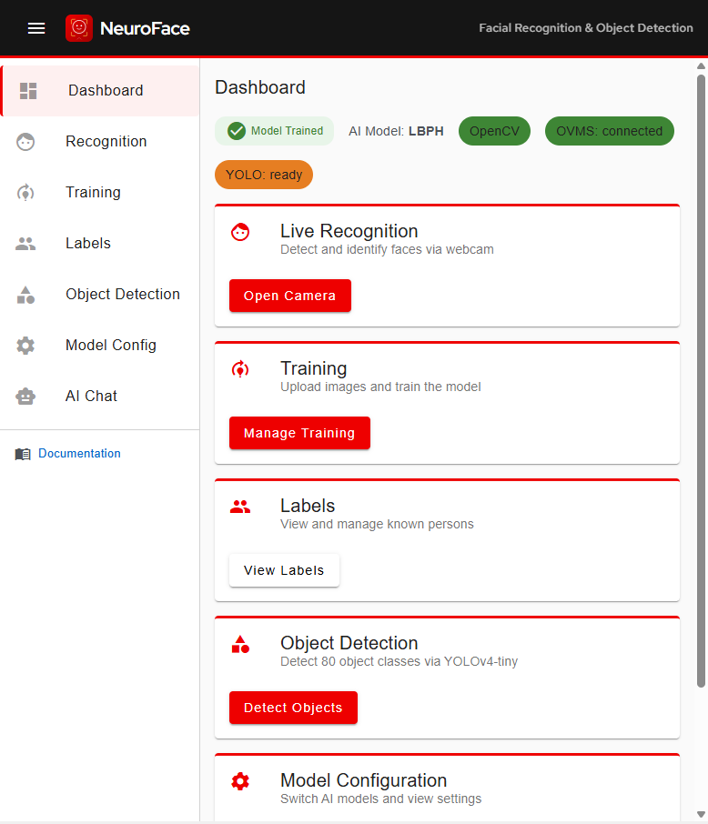
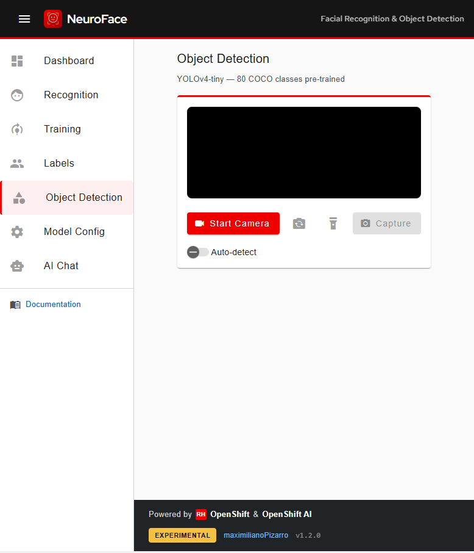
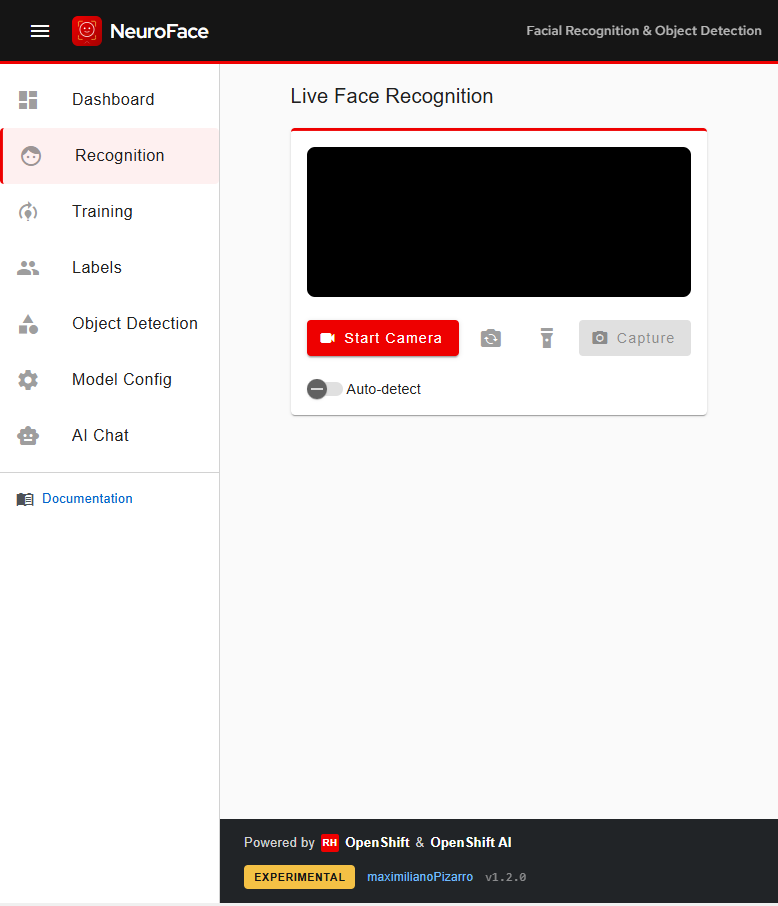
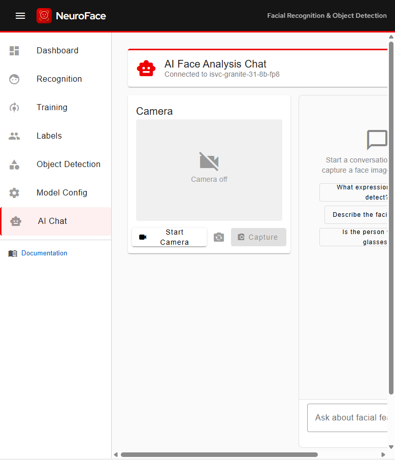
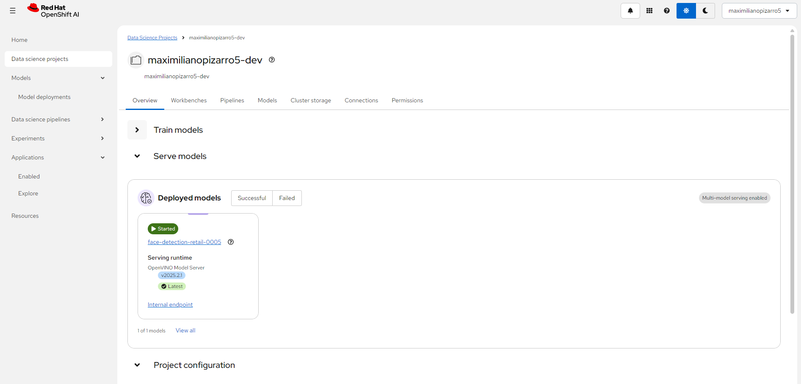
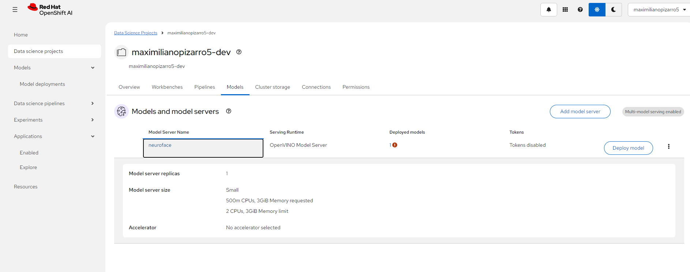
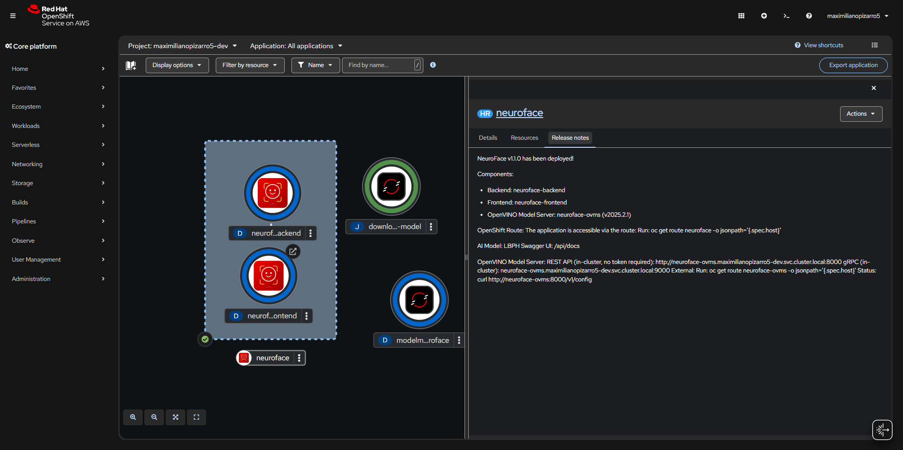
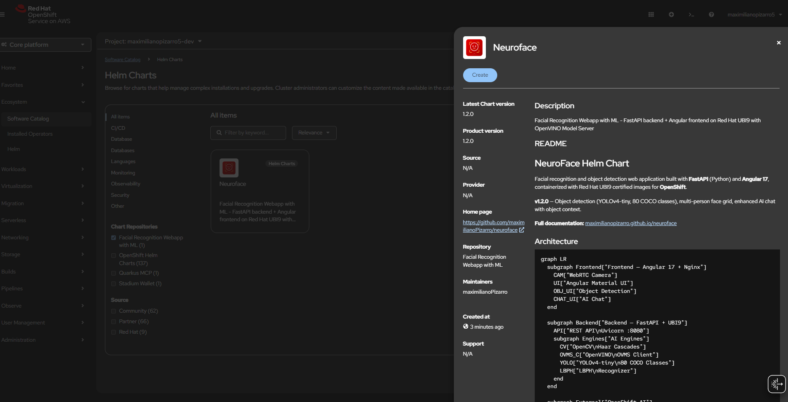
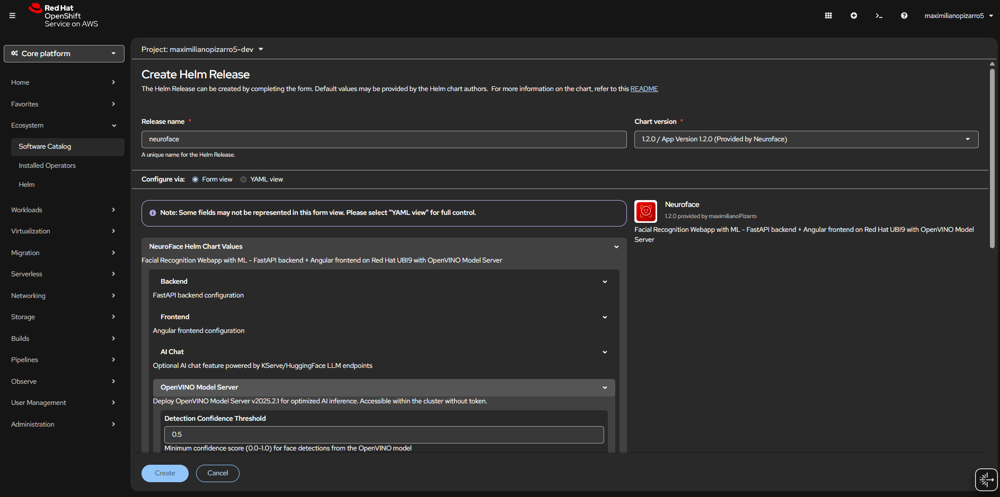
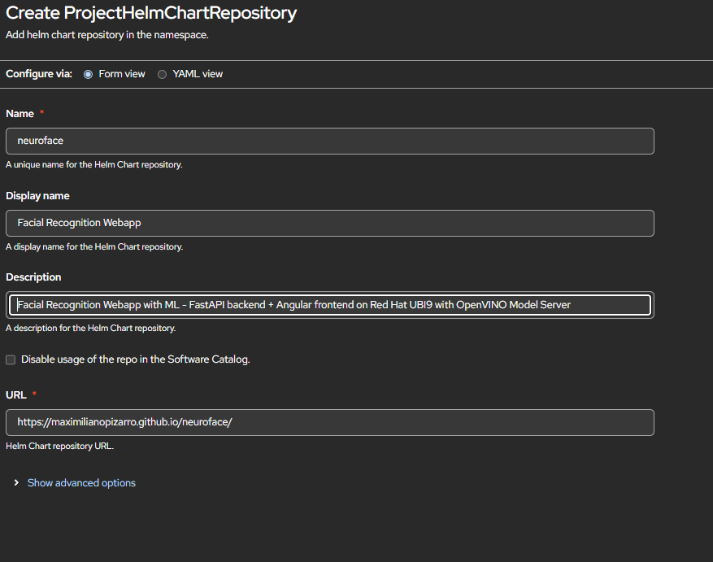

[](https://artifacthub.io/packages/helm/neuroface/neuroface)
[](https://github.com/maximilianoPizarro/neuroface/releases/tag/v1.2.0)
[](https://quay.io/repository/maximilianopizarro/neuroface-backend)
[](https://quay.io/repository/maximilianopizarro/neuroface-frontend)
[](https://developers.redhat.com/developer-sandbox)
[](https://github.com/maximilianoPizarro/neuroface/blob/main/LICENSE)

> **Experimental** — This is an experimental project for learning and demonstration purposes.

## Overview

NeuroFace is a facial recognition and object detection web application built with **FastAPI** (Python) and **Angular 17**, containerized with Red Hat UBI9 certified images for **OpenShift**. It supports:

**Face Detection Engines** (switchable at runtime):
- **OpenCV Haar Cascades** (default) — Local CPU-based detection, no external dependencies
- **OpenVINO Model Server** — Remote AI inference via OpenShift AI / ModelMesh using `face-detection-retail-0005`

**Recognition Models** (applied after detection):
- **OpenCV LBPH** (default) — Local Binary Patterns Histograms, fast and lightweight
- **dlib** (optional) — 128-dimensional face encodings via the face_recognition library

**Object Detection:**
- **YOLOv4-tiny** — 80 COCO classes pre-trained, via OpenCV DNN

### What's New in v1.2.0

- **Object Detection module** — YOLOv4-tiny with 80 COCO pre-trained classes (person, car, dog, chair, bottle, laptop, cell phone, and 73 more)
- **Multi-person face grid** — Simultaneous display for 3+ detected faces with individual face crops
- **Enhanced AI Chat** — Now includes object detection context and OpenVINO model info when analyzing images
- **Experimental badge** moved to footer only (removed from toolbar)
- **New sidebar navigation** includes Object Detection link

### Video Demo

<div style="display: flex; justify-content: center; margin: 16px 0;">
  <iframe width="320" height="569" src="https://www.youtube.com/embed/E52h4-aS5Rg" title="NeuroFace Demo" frameborder="0" allow="accelerometer; autoplay; clipboard-write; encrypted-media; gyroscope; picture-in-picture" allowfullscreen></iframe>
</div>

### Screenshots

#### Dashboard


#### Object Detection (YOLOv4-tiny - 80 COCO Classes)


#### Live Face Recognition


#### AI Face Analysis Chat


#### OpenShift AI — Model Server



#### OpenShift Topology


#### Helm Chart Install



#### Helm Repository


#### Dashboard v1.1.0


#### Model Config v1.1.0


## Architecture

### System Overview

<div class="mermaid">
graph LR
  subgraph Frontend["🖥️ Frontend — Angular 17 + Nginx"]
    CAM["📷 WebRTC Camera"]
    UI["🎨 Angular Material UI"]
    OBJ_UI["🔍 Object Detection"]
    CHAT_UI["💬 AI Chat"]
  end

  subgraph Backend["⚙️ Backend — FastAPI + UBI9"]
    API["REST API<br/>Uvicorn :8080"]
    subgraph Engines["AI Engines"]
      CV["OpenCV<br/>Haar Cascades"]
      OVMS_C["OpenVINO<br/>OVMS Client"]
      YOLO["YOLOv4-tiny<br/>80 COCO Classes"]
      LBPH["LBPH<br/>Recognizer"]
    end
  end

  subgraph External["☁️ OpenShift AI"]
    MM["ModelMesh<br/>:8008"]
    FACE_M["face-detection<br/>retail-0005"]
    LLM["LLM Endpoint<br/>Granite / LiteLLM"]
  end

  CAM -->|POST /api/recognize| API
  CAM -->|POST /api/objects/detect| API
  CHAT_UI -->|POST /api/chat| API
  UI -->|PUT /api/models| API

  API --> CV
  API --> OVMS_C
  API --> YOLO
  API --> LBPH
  OVMS_C -->|KServe V2| MM
  MM --> FACE_M
  API -->|OpenAI API| LLM
</div>

### Face Recognition Flow

<div class="mermaid">
flowchart TD
  A["📷 Camera captures frame<br/>(base64)"] --> B["POST /api/recognize"]
  B --> C{"Detection<br/>method?"}
  C -- opencv --> D["OpenCV Haar Cascade<br/>detectMultiScale"]
  C -- openvino --> E["OVMS REST call<br/>KServe V2 infer"]
  D --> F["Face bounding boxes<br/>(x, y, w, h)"]
  E --> F
  F --> G{"Model<br/>trained?"}
  G -- Yes --> H["LBPH predict<br/>on each ROI"]
  G -- No --> I["label = unknown<br/>confidence = 0"]
  H --> J{"confidence<br/>4-85?"}
  J -- Yes --> K["✅ Known person<br/>label + confidence"]
  J -- No --> I
  I --> L["Return faces[]<br/>+ detection_method"]
  K --> L
  L --> M["🖥️ Draw overlay<br/>+ multi-person grid"]
</div>

### Object Detection Flow

<div class="mermaid">
flowchart TD
  A["📷 Camera captures frame"] --> B["POST /api/objects/detect"]
  B --> C["OpenCV DNN<br/>YOLOv4-tiny"]
  C --> D["blobFromImage<br/>416x416, normalize"]
  D --> E["Forward pass<br/>through network"]
  E --> F["Parse detections<br/>80 COCO classes"]
  F --> G["NMS filter<br/>confidence > 0.4"]
  G --> H{"Objects<br/>found?"}
  H -- Yes --> I["Return objects[]<br/>+ summary counts"]
  H -- No --> J["Return empty<br/>count = 0"]
  I --> K["🖥️ Draw bounding boxes<br/>color per class"]
  J --> K
</div>

### Training Flow

<div class="mermaid">
flowchart TD
  A["👤 User enters label<br/>(person name)"] --> B["📷 Capture images<br/>from camera"]
  B --> C["POST /api/images<br/>save to /data/images/label/"]
  C --> D["POST /api/train"]
  D --> E{"Detection<br/>method?"}
  E -- opencv --> F["Haar Cascade<br/>on each image"]
  E -- openvino --> G["OVMS detect<br/>on each image"]
  F --> H["Extract face ROIs<br/>(grayscale)"]
  G --> H
  H --> I["LBPH train<br/>on all ROIs + labels"]
  I --> J["Save training.yml<br/>+ model.pickle"]
  J --> K["✅ Model trained<br/>labels + face count"]
</div>

### AI Chat Analysis Flow

<div class="mermaid">
flowchart TD
  A["💬 User sends message<br/>+ optional image"] --> B{"Image<br/>attached?"}
  B -- Yes --> C["Face analysis<br/>analyze_faces()"]
  C --> D["Object detection<br/>YOLOv4-tiny"]
  D --> E["Build context:<br/>faces + objects + method"]
  B -- No --> F["User message only"]
  E --> G["Compose prompt:<br/>system + context + question"]
  F --> G
  G --> H["POST to LLM<br/>OpenAI-compatible API"]
  H --> I["✅ Return response<br/>+ analysis data"]
</div>

## Helm Chart

### Quick Start (without OpenVINO)

```bash
helm repo add neuroface https://maximilianopizarro.github.io/neuroface/
helm install neuroface neuroface/neuroface
```

### Quick Start (with OpenVINO on OpenShift AI)

```bash
helm install neuroface neuroface/neuroface \
  --set ovms.externalUrl=http://modelmesh-serving:8008 \
  --set ovms.modelName=face-detection-retail-0005
```

### Configuration

| Value | Default | Description |
|-------|---------|-------------|
| `backend.aiModel` | `lbph` | Recognition model: `lbph` or `dlib` |
| `backend.image.tag` | `v1.2.0` | Backend container image tag |
| `frontend.image.tag` | `v1.2.0` | Frontend container image tag |
| `ovms.enabled` | `true` | Enable OpenVINO face detection |
| `ovms.externalUrl` | `""` | External OVMS/ModelMesh URL. When set, no standalone OVMS is deployed |
| `ovms.modelName` | `face-detection-retail-0005` | Face detection model name on OVMS |
| `ovms.confidenceThreshold` | `0.5` | Minimum detection confidence (0.0-1.0) |
| `ovms.defaultDetectionMethod` | `opencv` | Initial detection method: `opencv` or `openvino` |

---

## Deploying OpenVINO on Red Hat Developer Sandbox

This guide explains how to deploy `face-detection-retail-0005` on **OpenShift AI (RHOAI)** in a **Red Hat Developer Sandbox** so that NeuroFace can use it for remote face detection.

> The Helm chart includes all ModelMesh resources (ServingRuntime, PVC, Secret, download Job, InferenceService) as templates. Enable them with `--set ovms.modelmesh.enabled=true` for a single-command deployment.

### Option A: Automated (Helm chart deploys everything)

```bash
helm repo add neuroface https://maximilianopizarro.github.io/neuroface/
helm install neuroface neuroface/neuroface \
  --set ovms.externalUrl=http://modelmesh-serving:8008 \
  --set ovms.modelName=face-detection-retail-0005 \
  --set ovms.modelmesh.enabled=true
```

This single command deploys:
- **Frontend** + **Backend** + **PVC** (training data)
- **ServingRuntime** — OpenVINO adapter for ModelMesh
- **PVC** (2Gi) — Model storage
- **storage-config Secret** — Tells ModelMesh to use the PVC
- **Job** (post-install hook) — Downloads `face-detection-retail-0005` (FP16) from Intel Open Model Zoo
- **InferenceService** (post-install hook) — Registers the model on ModelMesh

Wait for the model download job and verify:

```bash
oc wait --for=condition=complete job/neuroface-download-model --timeout=300s
oc logs job/neuroface-download-model
oc wait --for=condition=Ready inferenceservice/face-detection-retail-0005 --timeout=300s
```

### Option B: Manual steps (for custom setups)

If you prefer to deploy ModelMesh resources manually or your cluster needs specific configuration:

#### Step 1: Create the ServingRuntime

```bash
oc apply -f - <<'EOF'
apiVersion: serving.kserve.io/v1alpha1
kind: ServingRuntime
metadata:
  name: neuroface
  annotations:
    openshift.io/display-name: "NeuroFace OpenVINO Runtime"
  labels:
    opendatahub.io/dashboard: "true"
spec:
  supportedModelFormats:
    - name: openvino_ir
      version: opset1
      autoSelect: true
    - name: onnx
      version: "1"
    - name: tensorflow
      version: "2"
  multiModel: true
  grpcDataEndpoint: port:8001
  grpcEndpoint: port:8085
  containers:
    - name: ovms
      image: quay.io/modelmesh-serving/ovms-adapter:latest
      args:
        - --port=8001
        - --rest_port=8888
        - --model_store=/models
        - --grpc_bind_address=127.0.0.1
        - --rest_bind_address=127.0.0.1
      resources:
        requests:
          cpu: 500m
          memory: 3Gi
        limits:
          cpu: "2"
          memory: 3Gi
  builtInAdapter:
    serverType: ovms
    runtimeManagementPort: 8888
    memBufferBytes: 134217728
    modelLoadingTimeoutMillis: 90000
EOF
```

#### Step 2: Create PVC + Storage Secret

```bash
oc apply -f - <<'EOF'
apiVersion: v1
kind: PersistentVolumeClaim
metadata:
  name: neuroface-models
spec:
  accessModes: [ReadWriteOnce]
  resources:
    requests:
      storage: 2Gi
---
apiVersion: v1
kind: Secret
metadata:
  name: storage-config
stringData:
  neuroface-models: |
    { "type": "pvc", "name": "neuroface-models" }
EOF
```

#### Step 3: Download the Model

```bash
oc apply -f - <<'EOF'
apiVersion: batch/v1
kind: Job
metadata:
  name: download-face-model
spec:
  backoffLimit: 2
  template:
    spec:
      containers:
        - name: downloader
          image: registry.access.redhat.com/ubi9/python-311:latest
          command: ["bash", "-c"]
          args:
            - |
              pip install openvino-dev[onnx,tensorflow] > /dev/null 2>&1
              omz_downloader --name face-detection-retail-0005 --precision FP16 -o /tmp/models
              mkdir -p /models/face-detection-retail-0005/1
              cp /tmp/models/intel/face-detection-retail-0005/FP16/* /models/face-detection-retail-0005/1/
              ls -la /models/face-detection-retail-0005/1/
          volumeMounts:
            - { name: model-storage, mountPath: /models }
      volumes:
        - name: model-storage
          persistentVolumeClaim: { claimName: neuroface-models }
      restartPolicy: Never
EOF
```

```bash
oc wait --for=condition=complete job/download-face-model --timeout=300s
```

#### Step 4: Deploy InferenceService

```bash
oc apply -f - <<'EOF'
apiVersion: serving.kserve.io/v1beta1
kind: InferenceService
metadata:
  name: face-detection-retail-0005
  annotations:
    serving.kserve.io/deploymentMode: ModelMesh
spec:
  predictor:
    model:
      modelFormat:
        name: openvino_ir
      runtime: neuroface
      storage:
        key: neuroface-models
        path: face-detection-retail-0005
EOF
```

```bash
oc wait --for=condition=Ready inferenceservice/face-detection-retail-0005 --timeout=300s
```

#### Step 5: Deploy NeuroFace (without modelmesh templates)

```bash
helm install neuroface neuroface/neuroface \
  --set ovms.externalUrl=http://modelmesh-serving:8008 \
  --set ovms.modelName=face-detection-retail-0005
```

### Verify

```bash
oc exec deployment/neuroface-backend -- \
  curl -s http://modelmesh-serving:8008/v2/models/face-detection-retail-0005
```

Expected:

```json
{
  "name": "face-detection-retail-0005__isvc-...",
  "platform": "OpenVINO",
  "inputs": [{"name": "input.1", "datatype": "FP32", "shape": ["1","3","300","300"]}],
  "outputs": [{"name": "527", "datatype": "FP32", "shape": ["1","1","200","7"]}]
}
```

---

## Using the UI

### Dashboard

The dashboard shows the current system status:

- **Model Trained** badge indicates if the LBPH recognizer is trained
- **OpenVINO** / **OpenCV** chip shows the active detection method
- **OVMS: connected** confirms connectivity to ModelMesh
- **YOLO: ready** confirms the object detector is loaded

### Object Detection

1. Go to **Object Detection** from the sidebar
2. Start the camera and enable **Auto-detect** to continuously detect objects
3. The module uses **YOLOv4-tiny** pre-trained on 80 COCO classes:

   person, bicycle, car, motorbike, aeroplane, bus, train, truck, boat, traffic light, fire hydrant, stop sign, parking meter, bench, bird, cat, dog, horse, sheep, cow, elephant, bear, zebra, giraffe, backpack, umbrella, handbag, tie, suitcase, frisbee, skis, snowboard, sports ball, kite, baseball bat, baseball glove, skateboard, surfboard, tennis racket, bottle, wine glass, cup, fork, knife, spoon, bowl, banana, apple, sandwich, orange, broccoli, carrot, hot dog, pizza, donut, cake, chair, sofa, pottedplant, bed, diningtable, toilet, tvmonitor, laptop, mouse, remote, keyboard, cell phone, microwave, oven, toaster, sink, refrigerator, book, clock, vase, scissors, teddy bear, hair drier, toothbrush

4. Detected objects are shown with bounding boxes and confidence scores
5. A summary panel shows object counts grouped by class

### Live Recognition (Multi-Person)

1. Go to **Recognition** and start the camera
2. Enable **Auto-detect** for continuous detection
3. When **3+ faces** are detected, individual face crops are shown in a grid below the camera
4. Each face card shows: cropped face image, identity label, confidence %, and dimensions

### AI Face Analysis Chat

1. Go to **AI Chat** — requires LLM endpoint configuration
2. Capture an image and ask questions about faces or objects
3. The chat now includes **object detection data** alongside face analysis data when an image is attached
4. OpenVINO detection method info is included in the context

### Training

1. Go to **Training** and use the fullscreen icon for distraction-free capture
2. On mobile, use the **flash/torch** button if you need more light
3. Enter a person name, then capture multiple images
4. Click **Start Training** to train the recognition model

### Model Configuration

Switch between detection methods at runtime:

- **Face Detection Method** — switch between OpenCV (local) and OpenVINO (remote)
- **Recognition Model** — select LBPH or dlib

---

## Container Images

| Image | Tag | Description |
|-------|-----|-------------|
| `quay.io/maximilianopizarro/neuroface-backend` | `latest` / `v1.0.1` | Stable release without OpenVINO |
| `quay.io/maximilianopizarro/neuroface-backend` | `v1.1.0` | With OpenVINO integration |
| `quay.io/maximilianopizarro/neuroface-backend` | `v1.1.1` | Red Hat UI + mobile flash |
| `quay.io/maximilianopizarro/neuroface-backend` | `v1.2.0` | Object detection + multi-person grid |
| `quay.io/maximilianopizarro/neuroface-frontend` | `latest` / `v1.0.1` | Stable release |
| `quay.io/maximilianopizarro/neuroface-frontend` | `v1.1.0` | With OpenVINO UI controls |
| `quay.io/maximilianopizarro/neuroface-frontend` | `v1.1.1` | Red Hat design + fullscreen training |
| `quay.io/maximilianopizarro/neuroface-frontend` | `v1.2.0` | Object detection + enhanced chat |

## API Endpoints (v1.2.0)

| Endpoint | Method | Description |
|----------|--------|-------------|
| `/api/health` | GET | Liveness probe |
| `/api/ready` | GET | Readiness probe (includes `ovms_status`, `object_detection`) |
| `/api/recognize` | POST | Detect + recognize faces |
| `/api/train` | POST | Train model using active detection method |
| `/api/images` | POST | Upload training image for a label |
| `/api/images/{label}` | GET/DELETE | List or delete images for a label |
| `/api/labels` | GET | List known persons/labels |
| `/api/models/config` | GET/PUT | View or change AI recognition model |
| `/api/models/detection` | PUT | Switch detection method: `opencv` or `openvino` |
| `/api/models/available` | GET | List models and detection methods with availability |
| `/api/objects/detect` | POST | Detect objects in image (YOLOv4-tiny, 80 COCO classes) |
| `/api/objects/classes` | GET | List all detectable object classes |
| `/api/objects/status` | GET | Object detector status and info |
| `/api/chat` | POST | AI chat with face + object analysis context |
| `/api/chat/status` | GET | Chat feature status |

## Links

- **Source:** [github.com/maximilianoPizarro/neuroface](https://github.com/maximilianoPizarro/neuroface)
- **Helm Chart:** [Artifact Hub](https://artifacthub.io/packages/helm/neuroface/neuroface)
- **Author:** [maximilianoPizarro](https://maximilianopizarro.github.io/)
- **Based on:** [reconocimiento-facial](https://github.com/maximilianoPizarro/reconocimiento-facial)
