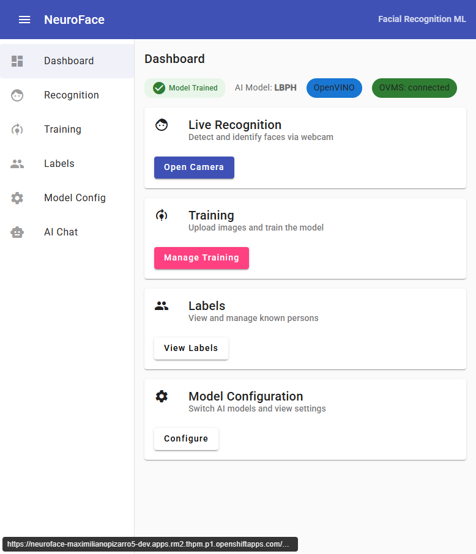
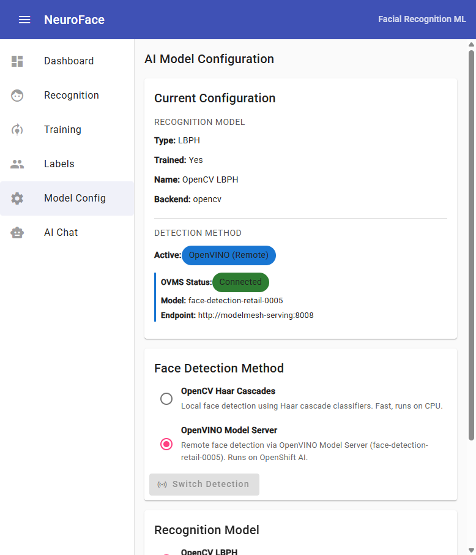

# NeuroFace - Facial Recognition Webapp with ML

## Overview

NeuroFace is a facial recognition web application built with **FastAPI** (Python) and **Angular 17**. It supports two face detection engines that can be switched at runtime:

- **OpenCV Haar Cascades** (default) — Local CPU-based detection, no external dependencies
- **OpenVINO Model Server** — Remote AI inference via OpenShift AI / ModelMesh using `face-detection-retail-0005`

Recognition models (applied after detection):

- **OpenCV LBPH** (default) — Local Binary Patterns Histograms, fast and lightweight
- **dlib** (optional) — 128-dimensional face encodings via the face_recognition library

## Architecture (v1.1.0)

```
┌──────────────────────────┐       ┌──────────────────────────────────┐
│  Frontend (Angular 17)   │       │  Backend (FastAPI on UBI9)       │
│                          │       │                                  │
│  WebRTC Camera ──────────┼─POST──┼─▶ /api/recognize                │
│  Training Upload ────────┼─POST──┼─▶ /api/images, /api/train       │
│  Model Config ───────────┼─PUT───┼─▶ /api/models/config            │
│  Detection Switch ───────┼─PUT───┼─▶ /api/models/detection         │
│                          │       │                                  │
│  Nginx (:8080)           │       │  Uvicorn (:8080)                │
└──────────────────────────┘       │  ┌────────────────────────────┐  │
                                   │  │ Detection (switchable)     │  │
                                   │  │  ├─ OpenCV Haar Cascades   │  │
                                   │  │  └─ OpenVINO OVMS ─────────┼──┼──▶ ModelMesh
                                   │  ├────────────────────────────┤  │    :8008
                                   │  │ Recognition (pluggable)    │  │
                                   │  │  ├─ LBPH (default)         │  │
                                   │  │  └─ dlib (optional)        │  │
                                   │  └────────────────────────────┘  │
                                   └──────────────────────────────────┘
```

## Helm Chart

### Quick Start (without OpenVINO)

```bash
helm repo add neuroface https://maximilianopizarro.github.io/neuroface/
helm install neuroface neuroface/neuroface
```

### Quick Start (with OpenVINO on OpenShift AI)

```bash
helm install neuroface neuroface/neuroface \
  --set ovms.externalUrl=http://modelmesh-serving:8008 \
  --set ovms.modelName=face-detection-retail-0005
```

### Configuration

| Value | Default | Description |
|-------|---------|-------------|
| `backend.aiModel` | `lbph` | Recognition model: `lbph` or `dlib` |
| `ovms.enabled` | `true` | Enable OpenVINO face detection |
| `ovms.externalUrl` | `""` | External OVMS/ModelMesh URL. When set, no standalone OVMS is deployed |
| `ovms.modelName` | `face-detection-retail-0005` | Face detection model name on OVMS |
| `ovms.confidenceThreshold` | `0.5` | Minimum detection confidence (0.0-1.0) |
| `ovms.defaultDetectionMethod` | `opencv` | Initial detection method: `opencv` or `openvino` |

---

## Deploying OpenVINO on Red Hat Developer Sandbox

This guide explains how to deploy the `face-detection-retail-0005` model on **OpenShift AI (RHOAI)** in a **Red Hat Developer Sandbox** so that NeuroFace can use it for face detection.

### Prerequisites

- A [Red Hat Developer Sandbox](https://developers.redhat.com/developer-sandbox) account
- `oc` CLI logged in to your sandbox
- OpenShift AI (RHOAI) enabled in your sandbox (enabled by default)

### Step 1: Create the ServingRuntime

The ServingRuntime defines the OpenVINO Model Server container that will serve models.

```bash
oc apply -f - <<'EOF'
apiVersion: serving.kserve.io/v1alpha1
kind: ServingRuntime
metadata:
  name: neuroface
  annotations:
    openshift.io/display-name: "NeuroFace OpenVINO Runtime"
  labels:
    opendatahub.io/dashboard: "true"
spec:
  supportedModelFormats:
    - name: openvino_ir
      version: opset1
      autoSelect: true
    - name: onnx
      version: "1"
    - name: tensorflow
      version: "2"
  multiModel: true
  grpcDataEndpoint: port:8001
  grpcEndpoint: port:8085
  containers:
    - name: ovms
      image: quay.io/modelmesh-serving/ovms-adapter:latest
      args:
        - --port=8001
        - --rest_port=8888
        - --model_store=/models
        - --grpc_bind_address=127.0.0.1
        - --rest_bind_address=127.0.0.1
      resources:
        requests:
          cpu: 500m
          memory: 3Gi
        limits:
          cpu: "2"
          memory: 3Gi
  builtInAdapter:
    serverType: ovms
    runtimeManagementPort: 8888
    memBufferBytes: 134217728
    modelLoadingTimeoutMillis: 90000
EOF
```

### Step 2: Create a PVC for Model Storage

```bash
oc apply -f - <<'EOF'
apiVersion: v1
kind: PersistentVolumeClaim
metadata:
  name: neuroface-models
spec:
  accessModes:
    - ReadWriteOnce
  resources:
    requests:
      storage: 2Gi
  storageClassName: gp3
EOF
```

### Step 3: Configure ModelMesh Storage

Create the `storage-config` secret that tells ModelMesh where to find models:

```bash
oc apply -f - <<'EOF'
apiVersion: v1
kind: Secret
metadata:
  name: storage-config
stringData:
  neuroface-models: |
    {
      "type": "pvc",
      "name": "neuroface-models"
    }
EOF
```

### Step 4: Download the Face Detection Model

This Job downloads Intel's `face-detection-retail-0005` model (OpenVINO IR, FP16) from the Open Model Zoo:

```bash
oc apply -f - <<'EOF'
apiVersion: batch/v1
kind: Job
metadata:
  name: download-face-model
spec:
  template:
    spec:
      containers:
        - name: downloader
          image: registry.access.redhat.com/ubi9/python-311:latest
          command:
            - bash
            - -c
            - |
              pip install openvino-dev[onnx,tensorflow] > /dev/null 2>&1
              omz_downloader --name face-detection-retail-0005 --precision FP16 \
                -o /tmp/models
              mkdir -p /models/face-detection-retail-0005/1
              cp /tmp/models/intel/face-detection-retail-0005/FP16/* \
                /models/face-detection-retail-0005/1/
              ls -la /models/face-detection-retail-0005/1/
          volumeMounts:
            - name: model-storage
              mountPath: /models
      volumes:
        - name: model-storage
          persistentVolumeClaim:
            claimName: neuroface-models
      restartPolicy: Never
  backoffLimit: 2
EOF
```

Wait for the job to complete:

```bash
oc wait --for=condition=complete job/download-face-model --timeout=300s
oc logs job/download-face-model
```

You should see `face-detection-retail-0005.xml` and `.bin` files listed.

### Step 5: Deploy the InferenceService

```bash
oc apply -f - <<'EOF'
apiVersion: serving.kserve.io/v1beta1
kind: InferenceService
metadata:
  name: face-detection-retail-0005
  annotations:
    serving.kserve.io/deploymentMode: ModelMesh
spec:
  predictor:
    model:
      modelFormat:
        name: openvino_ir
      runtime: neuroface
      storage:
        key: neuroface-models
        path: face-detection-retail-0005
EOF
```

Wait for the model to load:

```bash
oc wait --for=condition=Ready inferenceservice/face-detection-retail-0005 --timeout=300s
```

### Step 6: Verify the Model

```bash
oc exec deployment/neuroface-backend -- \
  curl -s http://modelmesh-serving:8008/v2/models/face-detection-retail-0005
```

Expected output:

```json
{
  "name": "face-detection-retail-0005__isvc-...",
  "platform": "OpenVINO",
  "inputs": [{"name": "input.1", "datatype": "FP32", "shape": ["1","3","300","300"]}],
  "outputs": [{"name": "527", "datatype": "FP32", "shape": ["1","1","200","7"]}]
}
```

### Step 7: Deploy NeuroFace

```bash
helm install neuroface neuroface/neuroface \
  --set ovms.externalUrl=http://modelmesh-serving:8008 \
  --set ovms.modelName=face-detection-retail-0005
```

The backend auto-detects the model's input/output tensor names from the OVMS metadata endpoint.

---

## Using the UI

### Dashboard

The dashboard shows the current status:



- **Model Trained** badge indicates if the LBPH recognizer is trained
- **OpenVINO** / **OpenCV** chip shows the active detection method
- **OVMS: connected** confirms connectivity to ModelMesh

### Model Configuration

Switch between detection methods at runtime:



- **Current Configuration** shows recognition model + detection method details
- **Face Detection Method** radio buttons to switch between OpenCV (local) and OpenVINO (remote)
- **Recognition Model** selector for LBPH or dlib

### Workflow

1. Go to **Training** → upload images or capture from webcam
2. Click **Start Training** — the active detection method (OpenCV or OpenVINO) extracts faces from images, then LBPH trains on the face ROIs
3. Go to **Recognition** → enable auto-detect to see live face detection and recognition
4. Switch detection method anytime from **Model Config** — no re-training needed for detection, but you can re-train if you want to compare results

---

## Container Images

| Image | Tag | Description |
|-------|-----|-------------|
| `quay.io/maximilianopizarro/neuroface-backend` | `latest` / `v1.0.1` | Stable release without OpenVINO |
| `quay.io/maximilianopizarro/neuroface-backend` | `v1.1.0` | With OpenVINO integration |
| `quay.io/maximilianopizarro/neuroface-frontend` | `latest` / `v1.0.1` | Stable release |
| `quay.io/maximilianopizarro/neuroface-frontend` | `v1.1.0` | With OpenVINO UI controls |

## API Endpoints (v1.1.0)

| Endpoint | Method | Description |
|----------|--------|-------------|
| `/api/health` | GET | Liveness probe |
| `/api/ready` | GET | Readiness probe (includes `ovms_status`, `detection_method`) |
| `/api/recognize` | POST | Detect + recognize faces (returns `detection_method` used) |
| `/api/train` | POST | Train model using active detection method |
| `/api/models/config` | GET/PUT | View or change recognition model |
| `/api/models/detection` | PUT | Switch detection method: `opencv` or `openvino` |
| `/api/models/available` | GET | List models and detection methods with availability |

## Links

- **Source:** [github.com/maximilianoPizarro/neuroface](https://github.com/maximilianoPizarro/neuroface)
- **Helm Chart:** [Artifact Hub](https://artifacthub.io/packages/helm/neuroface/neuroface)
- **Based on:** [reconocimiento-facial](https://github.com/maximilianoPizarro/reconocimiento-facial)
