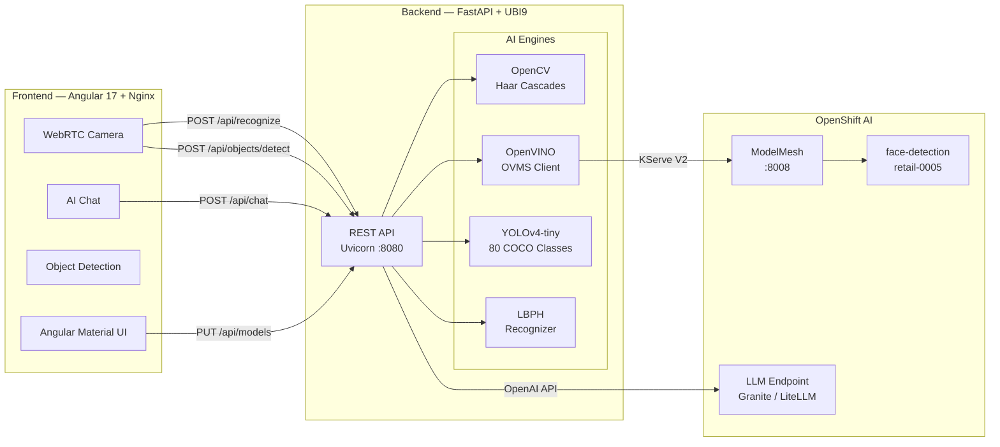
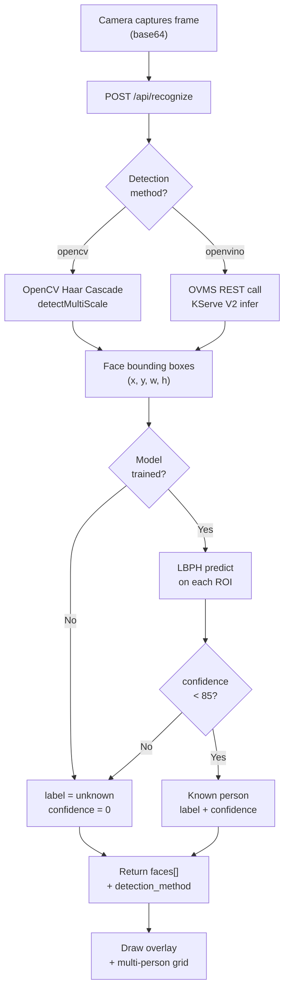
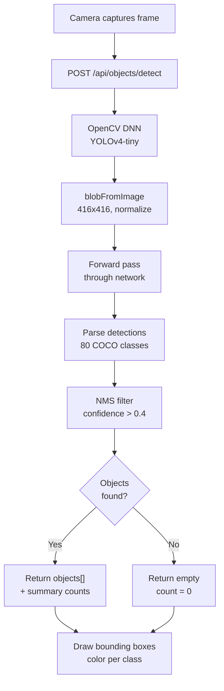
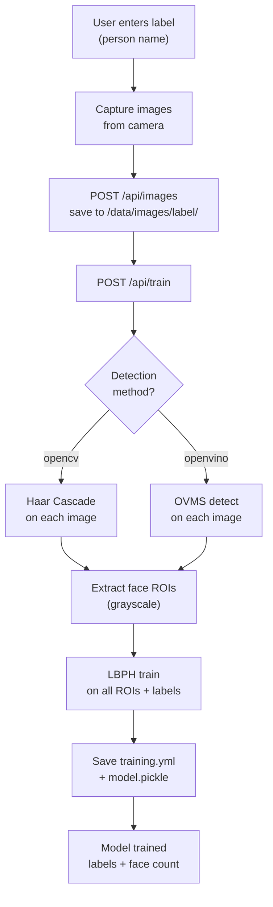

# NeuroFace Helm Chart

[](https://artifacthub.io/packages/helm/neuroface/neuroface)
[](https://github.com/maximilianoPizarro/neuroface/releases/tag/v1.4.0)
[](https://quay.io/repository/maximilianopizarro/neuroface-backend)
[](https://quay.io/repository/maximilianopizarro/neuroface-frontend)
[](https://developers.redhat.com/developer-sandbox)

Facial recognition and object detection web application built with **FastAPI** (Python) and **Angular 17**, containerized with Red Hat UBI9 certified images for **OpenShift**.

**v1.4.0** — Pre-built YOLO PPE serving image with KServe v1+v2 protocol, PPE detection data persistence for retraining via S3/MinIO.

### What's New in v1.4.0

- **Pre-built PPE serving container** (`neuroface-ppe-serving`) — Cold start < 60s, all dependencies pre-installed
- **KServe v2 inference protocol** — `/v2/models/yolo-ppe/infer` + `/v2/models/yolo-ppe/ready` alongside existing v1
- **PPE data persistence** — Upload detection frames + YOLO labels to S3/MinIO for retraining workbenches

> **Full documentation:** [maximilianopizarro.github.io/neuroface](https://maximilianopizarro.github.io/neuroface/)

---

## Architecture



## Face Recognition Flow



## Object Detection Flow



## Training Flow



---

## Prerequisites

- Kubernetes 1.23+ or OpenShift 4.x
- Helm 3.x

## Installation

```bash
helm repo add neuroface https://maximilianopizarro.github.io/neuroface/
helm repo update
helm install neuroface neuroface/neuroface
```

### With OpenVINO (external ModelMesh)

```bash
helm install neuroface neuroface/neuroface \
  --set ovms.externalUrl=http://modelmesh-serving:8008 \
  --set ovms.modelName=face-detection-retail-0005
```

When `ovms.externalUrl` is set, no standalone OVMS is deployed — the backend connects to the existing ModelMesh service.

## Values

| Parameter | Description | Default |
|-----------|-------------|---------|
| `backend.image.repository` | Backend image | `quay.io/maximilianopizarro/neuroface-backend` |
| `backend.image.tag` | Backend image tag | `v1.4.0` |
| `backend.replicas` | Backend replicas | `1` |
| `backend.aiModel` | AI model type (lbph / dlib) | `lbph` |
| `backend.resources.limits.cpu` | Backend CPU limit | `500m` |
| `backend.resources.limits.memory` | Backend memory limit | `512Mi` |
| `frontend.image.repository` | Frontend image | `quay.io/maximilianopizarro/neuroface-frontend` |
| `frontend.image.tag` | Frontend image tag | `v1.4.0` |
| `frontend.replicas` | Frontend replicas | `1` |
| `route.enabled` | Create OpenShift Route | `true` |
| `route.host` | Route hostname (auto if empty) | `""` |
| `persistence.enabled` | Enable PVC for training data | `true` |
| `persistence.size` | PVC size | `1Gi` |
| `ovms.enabled` | Enable OpenVINO detection | `true` |
| `ovms.externalUrl` | External OVMS/ModelMesh REST URL | `""` |
| `ovms.modelName` | Model name on OVMS | `face-detection-retail-0005` |
| `ovms.confidenceThreshold` | Detection confidence threshold | `0.5` |
| `ovms.defaultDetectionMethod` | Initial detection method | `opencv` |
| `chat.enabled` | Enable AI chat feature | `true` |
| `ppe.enabled` | Enable PPE safety detection | `false` |
| `ppe.endpoint` | PPE YOLO serving URL | `""` |
| `ppe.classes` | Expected PPE classes (comma-separated) | `hardhat,safety-vest,goggles` |
| `ppe.serving.image.tag` | PPE serving image tag | `v1.4.0` |
| `ppe.dataPersistence.enabled` | Upload detections to S3/MinIO for retraining | `false` |
| `ppe.dataPersistence.s3Endpoint` | S3/MinIO endpoint URL | `""` |
| `ppe.dataPersistence.s3Bucket` | Target bucket | `models` |
| `ppe.dataPersistence.s3Prefix` | Key prefix for images/labels | `ppe-detection/training-data` |
| `ppe.dataPersistence.samplingRate` | Fraction of frames to persist (0.0-1.0) | `1.0` |

## API Endpoints

| Endpoint | Method | Description |
|----------|--------|-------------|
| `/api/health` | GET | Liveness probe |
| `/api/ready` | GET | Readiness probe (includes `ovms_status`, `object_detection`) |
| `/api/recognize` | POST | Detect + recognize faces |
| `/api/train` | POST | Train model using active detection method |
| `/api/images` | POST | Upload training image for a label |
| `/api/images/{label}` | GET/DELETE | List or delete images for a label |
| `/api/labels` | GET | List known persons/labels |
| `/api/models/config` | GET/PUT | View or change AI recognition model |
| `/api/models/detection` | PUT | Switch detection method: `opencv` or `openvino` |
| `/api/objects/detect` | POST | Detect objects (YOLOv4-tiny, 80 COCO classes) |
| `/api/objects/classes` | GET | List all 80 detectable COCO classes |
| `/api/objects/status` | GET | Object detector status |
| `/api/chat` | POST | AI chat with face + object analysis context |
| `/api/ppe/detect` | POST | PPE compliance detection via YOLO serving |
| `/api/ppe/status` | GET | PPE serving status + data persistence config |

### PPE Serving Endpoints (neuroface-ppe-serving)

| Endpoint | Method | Description |
|----------|--------|-------------|
| `/health` | GET | Liveness + model info |
| `/v1/predict` | POST | KServe v1 — raw JPEG bytes |
| `/v2/models/yolo-ppe/infer` | POST | KServe v2 — octet-stream or JSON tensor |
| `/v2/models/yolo-ppe/ready` | GET | Model readiness |
| `/v2/models/yolo-ppe` | GET | Model metadata |
| `/v2/health/live` | GET | v2 liveness |
| `/v2/health/ready` | GET | v2 readiness |

## Container Images

| Image | Tag | Description |
|-------|-----|-------------|
| `quay.io/maximilianopizarro/neuroface-backend` | `v1.4.0` | PPE data persistence + S3 upload |
| `quay.io/maximilianopizarro/neuroface-frontend` | `v1.4.0` | PPE UI + all features |
| `quay.io/maximilianopizarro/neuroface-ppe-serving` | `v1.4.0` | Pre-built YOLO PPE (KServe v1+v2) |
| `quay.io/maximilianopizarro/neuroface-backend` | `v1.3.0` | PPE + Kafka |
| `quay.io/maximilianopizarro/neuroface-frontend` | `v1.3.0` | PPE Safety UI |

## Uninstall

```bash
helm uninstall neuroface
```

---

Project maintained by [maximilianoPizarro](https://maximilianopizarro.github.io/)
